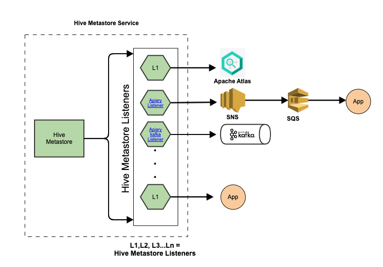
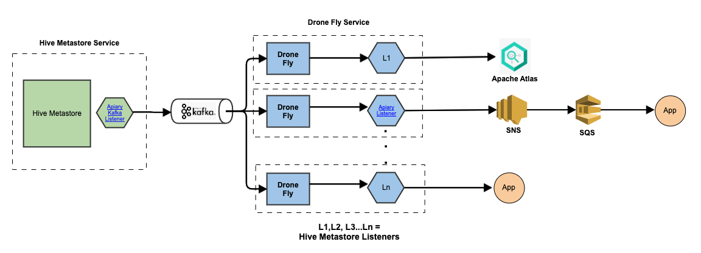

# Drone Fly
A service which allows Hive metastore (HMS) `MetaStoreEventListener` implementations to be deployed in a separate context to the metastore's own.

## Overview
Drone Fly is a distributed Hive metastore events forwarder service that allows users to deploy metastore listeners outside the Hive metastore service.

With the advent of event driven systems, the number of listeners that a user needs to install in the metastore is ever increasing. These listeners can be both internal or can be provided by third party tools for integration purposes. More and more processing is being added to these listeners to address various business use cases.

Adding these listeners directly on the classpath of your Hive metastore couples them with it and can lead to performance degradation or in the worst case, it could take down the entire metastore (e.g. by running out memory, thread starvation etc.) Drone Fly decouples your HMS from the event listeners by providing a virtual Hive context. The event listeners can be provided on the Drone Fly's classpath and it then forwards the events received from [Kafka metastore Listener](https://github.com/ExpediaGroup/apiary-extensions/tree/master/apiary-metastore-events/kafka-metastore-events/kafka-metastore-listener) on to the respective listeners.

## Start using

A Terraform module for kubernetes deployment is available [here](https://github.com/ExpediaGroup/apiary-drone-fly).

Docker images can be found in Expedia Group's [dockerhub](https://hub.docker.com/search/?q=expediagroup%2Fdrone-fly&type=image).

## System architecture

The diagram below shows a typical Hive metastore setup without using Drone Fly. In this example there are a number of HiveMetastoreListeners installed which send Hive events to other systems like Apache Atlas, AWS SNS, Apache Kafka and other custom implementations.



With Drone Fly, the setup gets modified as shown in the diagram below. The only listener installed in the Hive metastore context is the [Apiary Kafka Listener](https://github.com/ExpediaGroup/apiary-extensions/tree/master/apiary-metastore-events/kafka-metastore-events/kafka-metastore-listener). This forwards the Hive events on to Kafka from which Drone Fly can retrieve them. The other listeners are moved out into separate contexts and receive the messages from Drone Fly which forwards them on as if they were Hive events so the listener code doesn't need to change at all.



Drone Fly can be set up to run in dockerized containers where each instance is initiated with one listener to get even further decoupling.

## Usage
### Using with Docker

To install a new HMS listener within Drone Fly context, it is recommended that you build your docker image using Drone Fly base [Docker image](https://hub.docker.com/r/expediagroup/drone-fly-app).

A sample image to install [Apiary-SNS-Listener](https://github.com/ExpediaGroup/apiary-extensions/tree/master/apiary-metastore-events/sns-metastore-events/apiary-metastore-listener) would look like as follows:

```
from expediagroup/drone-fly-app:0.0.1

ENV APIARY_EXTENSIONS_VERSION 6.0.1

ENV AWS_REGION us-east-1
RUN cd /app/libs && \
wget -q https://search.maven.org/remotecontent?filepath=com/expediagroup/apiary/apiary-metastore-listener/${APIARY_EXTENSIONS_VERSION}/apiary-metastore-listener-${APIARY_EXTENSIONS_VERSION}-all.jar -O apiary-metastore-listener-${APIARY_EXTENSIONS_VERSION}-all.jar
```

#### Running DroneFly Docker image

	docker run --env APIARY_BOOTSTRAP_SERVERS="localhost:9092" \
		   --env APIARY_LISTENER_LIST="com.expediagroup.sampleListener1,com.expediagroup.sampleListener2" \
		   --env APIARY_KAFKA_TOPIC_NAME="dronefly" \
		         expediagroup/drone-fly-app:<image-version>

Then [Drone Fly Terraform](https://github.com/ExpediaGroup/apiary-drone-fly) module can be used to install your Docker image in a Kubernetes container.


### Using Uber Jar

Drone Fly build also produces an [uber jar](https://mvnrepository.com/artifact/com.expediagroup/drone-fly-app) so it can be started as a stand-alone Java service.

#### Running DroneFly Jar

	java -Dloader.path=lib/ -jar drone-fly-app-<version>-exec.jar \
		--apiary.bootstrap.servers=localhost:9092 \
		--apiary.kafka.topic.name=apiary \
		--apiary.listener.list="com.expediagroup.sampleListener1,com.expediagroup.sampleListener2"	
	
The properties `instance.name`, `apiary.bootstrap.servers`, `apiary.kafka.topic.name` and `apiary.listener.list` can also be provided in the spring properties file.
	
	java -Dloader.path=lib/ -jar drone-fly-app-<version>-exec.jar --spring.config.location=file:///dronefly.properties
	
The parameter `-Dloader-path` is the path where Drone Fly will search for configured HMS listeners. By default, Drone Fly starts up on port `8008` but it can be configured using standar

## Configuring Drone Fly

### Drone Fly configuration reference
The table below describes all the available configuration values for Drone Fly.

| Name | Description | Type | Default | Required |
|------|-------------|------|---------|:--------:|
| apiary.bootstrap.servers | Kafka bootstrap servers that receive Hive metastore events. | `string` | n/a | yes |
| apiary.kafka.topic.name | Kafka topic name that receive Hive metastore events. | `string` | n/a | yes |
| apiary.listener.list | Comma separated list of Hive metastore listeners to load from classpath. eg. `com.expedia.HMSListener1,com.expedia.HMSListener2` | `string` | `"com.expediagroup.dataplatform.dronefly.app.service.listener.LoggingMetastoreListener"` | no |
| instance.name | Instance name for a Drone Fly instance. `instance.name` is also used to derive Kafka consumer group. Therefore, in a multi-instance deployment, unique `instance.name` for each Drone Fly instance needs to be provided to avoid all instances ending up in same Kafka consumer group. | `string` | `drone-fly` | no |
| endpoint.port | Port on which Drone Fly Spring Boot app will start. | `string` | `8008` | no |


## Metrics

Drone Fly exposes standard [JVM and Kafka metrics](https://docs.spring.io/spring-boot/docs/current/reference/htmlsingle/#production-ready-metrics-meter) using [Prometheus on Spring Boot Actuator](https://docs.spring.io/spring-boot/docs/current/reference/html/production-ready-features.html#production-ready-metrics-export-prometheus) endpoint `/actuator/prometheus`.

## Legal
This project is available under the [Apache 2.0 License](http://www.apache.org/licenses/LICENSE-2.0.html).

Copyright 2020 Expedia, Inc.


